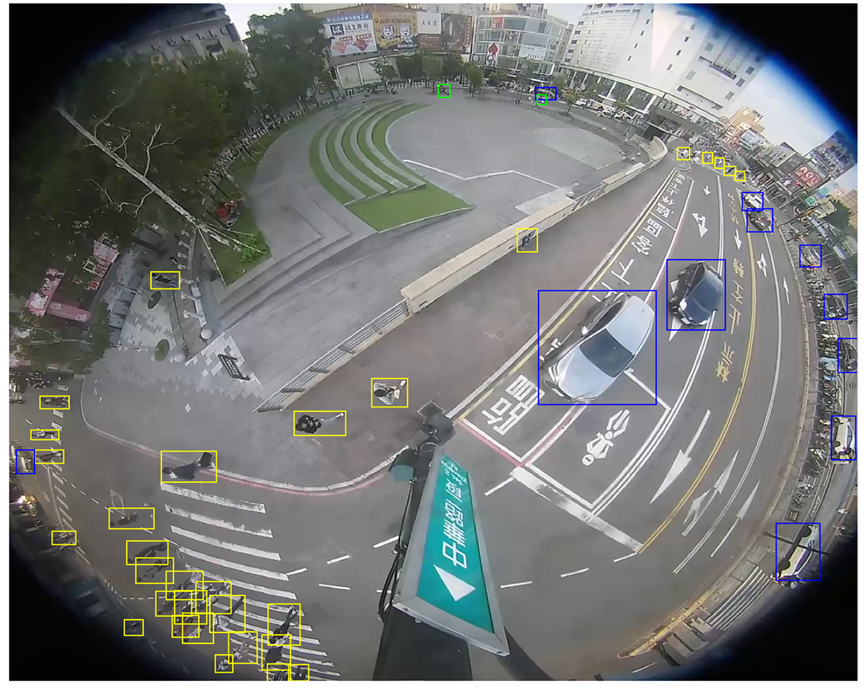

## [ICCV 2025] AICity Challenge Track 4 : Real-Time Object Detection on Edge Devices: A Fisheye Specific DFINE

<p align="center">
  
</p>

This repository contains the **Xiilab Team** solution for the **ICCV 2025 AICity Challenge Track 4**, focusing on **fisheye object detection**.

We build upon **DFINE** and adapt the model and training pipeline specifically for fisheye imagery. Our contributions include:

- **Fisheye-specific augmentations** to handle geometric distortions  
- **Semi-supervised data preparation** leveraging unlabeled fisheye data  
- An enhanced **DFINE-based training pipeline** optimized for fisheye perception  

These adaptations enable robust detection performance in wide-angle, distorted driving scenes commonly encountered in real-world fisheye applications.

### 1. Setup

- Docker (inference for Jetson)
```bash
docker pull xiilab/aicity_iccv_2025_track4_jetson:latest
docker run -it --ipc=host --gpus all \
  -v $(pwd):/workspace \
  xiilab/aicity_iccv_2025_track4_jetson:latest
```

- Server (train/test on server)
```bash
pip install -r requirements.txt
```

- Training Docker (server)
  - Environment: 4 × NVIDIA A40 GPUs
  - Docker Image: `xiilab/aicity_iccv_2025_track4_train:latest` ([Docker Hub](https://hub.docker.com/r/xiilab/aicity_iccv_2025_track4_train))
  - Container Launcher: `run_docker_train.sh`
  - Training Script: `run_pipeline.sh` (multi-GPU via PyTorch `torchrun`)
  - Model Export: `convert_pytorch_to_onnx.py` (export to ONNX)


### 2. Dataset structure and location

- Data root: `dataset`
- Annotation JSON must be in COCO format
- Download: Google Drive dataset folder — [link](https://drive.google.com/drive/folders/1B4tpLAjWREeUtutJTaTaanfvjeFxB0O2?hl=ko)

Example directory
```text
dataset
├─ train/                 # image folder (example)
├─ val/                   # image folder (example)
└─ annotations/
   ├─ instances_train.json
   └─ instances_val.json
```

Set paths in `configs/dataset/*.yml`
```yaml
train_dataloader:
  dataset:
    img_folder: dataset/train/
    ann_file: dataset/annotations/instances_train.json
val_dataloader:
  dataset:
    img_folder: dataset/val/
    ann_file: dataset/annotations/instances_val.json
```

### 3. Training

Basic run
```bash
python train.py -c configs/dfine/dfine_hgnetv2_l_coco.yml -t pretrained.pth
```

Common options
- `--use-amp`, `--device cuda:0`
- `--output-dir`, `--summary-dir`
- `--best-metric {ap,f1}`

Example
```bash
python train.py \
  -c configs/dfine/dfine_hgnetv2_l_coco.yml \
  --use-amp --device cuda:0 --best-metric f1 \
  --output-dir output/run1 \
  --summary-dir output/run1/summary
```

Notes
- Stage1 augmentation module: `data_aug_gen.py`
- Stage1/Stage2 pretrained checkpoints: Hugging Face [Xiilab-model/AICity_track4](https://huggingface.co/Xiilab-model/AICity_track4)

### 3-1. Stage1 Augmentation

Stage1 uses basic augmentation for initial training.

Stage1 augmentation example
```bash
python data_aug_gen.py \
  -i path/to/images \
  -j path/to/annotations.json \
  -o output/augmented/images \
  -a output/augmented/annotations.json \
  -n 3 \
  --validation-dir output/augmentation_validation
```

### 3-2. Stage2 Finetuning (Fisheye-specific Augmentation)

Stage2 is based on the pretrained Stage1 checkpoint, with an additional **extended fisheye-specific augmentation set** applied for further finetuning.  

Key points:
- Starts from the Stage1 weights `best_stg1.pth`
- Applies **40+ custom augmentations** designed for real-world fisheye conditions
- Uses a `stop_epoch` policy to automatically disable strong augmentations after a certain epoch
- Goal: **Optimize validation F1 score and enhance robustness under real-world fisheye scenarios**

#### Fisheye-specific Augmentations Include:
- **Distortion Effects**: Fisheye lens distortion, barrel/pincushion distortion, radial distortion
- **Lens Characteristics**: Vignette effects, chromatic aberration, lens simulation
- **Lighting & Weather**: Rain, fog, glare, shadow effects
- **Motion & Blur**: Motion blur, radial blur, zoom blur
- **Edge & Contrast**: Edge enhancement, contrast adjustment, low contrast enhancement
- **Object Enhancement**: Small object amplification, boundary refinement
- **Advanced Effects**: HDR, depth of field, lens flare simulation

#### Implementation Details:
- Augmentation transforms are defined in `src/data/transforms/_transforms_stage2.py`
- Each augmentation includes probability-based application and parameter randomization
- Bounding box coordinates are properly transformed for geometric augmentations
- Supports both PIL Image and torchvision Image tensor formats

Example run:
```bash
CUDA_VISIBLE_DEVICES=0,1,2,3 torchrun --master_port=7777 --nproc_per_node=4 \
  train.py \
  --c configs/dfine/custom/dfine_hgnetv2_m_custom.yml \
  --tuning best_f1_stg1_1280.pth \
  --use-amp --seed=0
```

Pseudo-label generation (WBF ensemble)
- Script: `active_learning/wtf_1k.py`
- Purpose: Ensemble multiple COCO prediction JSONs with WBF to produce a pseudo-label COCO JSON and visualizations
- Usage:
  1) Edit top variables in the script: `json_paths` (list of input prediction JSONs), `image_dir`, `output_json`, `output_vis_dir`
  2) Optional params: `iou_thr`, `skip_box_thr`, `wbf_weights`, `DEBUG`
  3) Run:
```bash
python active_learning/wtf_1k.py
```

Pseudo-label generation (batch inference, Stage1 checkpoint)
- Script: `active_learning/dfine_pseudo_inference.sh`
- Purpose: Run batch inference on unlabeled images using a trained Stage1 checkpoint to generate pseudo predictions
- Run (recommended):
```bash
bash active_learning/dfine_pseudo_inference.sh
```
- Direct equivalent command:
```bash
python tools/inference/torch_inf_multi_gpu_batch_optimized.py \
  -c configs/dfine/custom/dfine_hgnetv2_l_custom.yml \
  -r output/dfine_hgnetv2_l_custom/best_stg1.pth \
  -i path/to/unlabeled/images \
  -o output/pseudo_predictions \
  --batch-size 16 \
  --num-gpus 4
```

### 4. Evaluation

```bash
python train.py -c configs/dfine/dfine_hgnetv2_l_coco.yml --test-only --resume /path/to/checkpoint.pth
```
- Prints COCO mAP and additional metrics (F1/Precision/Recall/IoU)

### 5. Inference and submission

Script: `tools/inference/torch_inf.py`

Single image
```bash
python tools/inference/torch_inf.py \
  -c configs/dfine/dfine_hgnetv2_l_coco.yml \
  -r output/dfine_hgnetv2_l_custom/best_stg1.pth \
  -i /path/to/image.png -o /path/to/out --device cuda:0 \
  --output-format submission --threshold 0.4
```

Folder/Video
```bash
python tools/inference/torch_inf.py -c <cfg> -r <ckpt> -i /path/to/dir_or_video -o /path/to/out --device cuda:0
```

Output
- Visualization: `<out>/`
- Annotation JSON: `<out>/annotations/`
- Submission format: `--output-format submission`

See `train.py` and `configs/` for details and checkpoint saving rules.

- Multi-GPU batch inference
```bash
python tools/inference/torch_inf_multi_gpu_batch.py -h
```
Example
```bash
CUDA_VISIBLE_DEVICES=0,1 python tools/inference/torch_inf_multi_gpu_batch.py \
  -c <cfg> -r <ckpt> -i /path/to/dir -o /path/to/out
```

